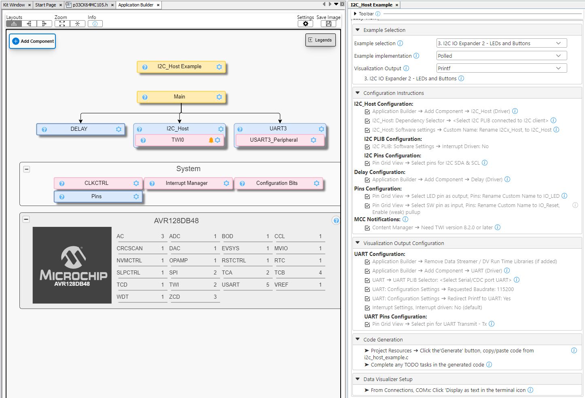
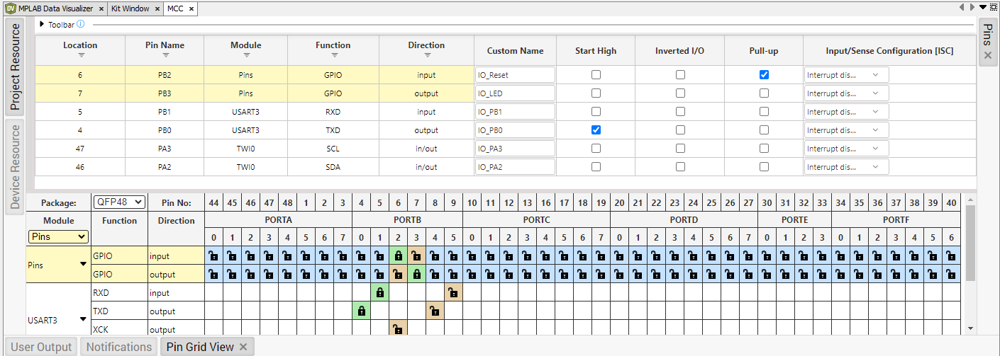

<!-- MPAE-19439 Please do not change this logo with link -->

<a target="_blank" href="https://www.microchip.com/" id="top-of-page">
   <picture>
      <source media="(prefers-color-scheme: light)" srcset="images/mchp_logo_light.png" width="350">
      <source media="(prefers-color-scheme: dark)" srcset="images/mchp_logo_dark.png" width="350">
      
   </picture>
</a>

# AVR128DB48 I2C_Host Example Component for CNano Explorer: I/O Expander 2 LEDs and BUTTONs (Polled, Printf)

The [I2C Host IO Expander 2 - LEDs and Buttons Example](https://onlinedocs.microchip.com/v2/keyword-lookup?keyword=I2C.HOST.EX.RUNNING.I2C.HOST.IOEXPANDER2.LEDS.BUTTONS&version=latest&redirect=true "I2C Host IO Expander 1 - LEDs Example"
), of the [MCC Melody I2C Example Component (for the Curiosity Nano Explorer)](https://onlinedocs.microchip.com/v2/keyword-lookup?keyword=I2C.HOST.EXAMPLE.COMPONENT&version=latest&redirect=true "MCC Melody I2C Example Component for the Curiosity Nano Explorer"
), is used here in the Polled implementation with the Printf visualization. 

On the Curiosity Nano Explorer, the pins on the I2C I/O Expander 1 are connected to active-low LEDs, while the pins on the I2C I/O Expander 2 are connected to buttons (SW1, SW2 and SW3) as well as the joystick inputs (left, right, up, down, press).

This example configures the I/O Expander 1 pins as outputs set LOW, so the active-low LEDs are initially all turned on. The I/O Expander 2 pins are configured as digital inputs. As a button press or joystick input is detected, the associated LED is turned off. The Curiosity Nano's SW is configured as a reset, turning on all the LEDs again.  

## Operation
When running the application using the [MPLAB® Data Visualizer](https://www.microchip.com/en-us/tools-resources/debug/mplab-data-visualizer "MPLAB® Data Visualizer"), you should see something similar to the following: 

When running the application, using the MPLAB Data Visualizer, you should see something similar to the following: 

**Note:** Behaviour is not as reliable as in the Callbacks version. 

**Note:** Debug I/O is not actively used. However, since the SW pin on the Curiosity Nano is a Debug I/O pin, so when pushing the IO_Reset, a toggle is picked up on the Debug I/O pin. 

## Setup
The image below outlines the complete MPLAB Code Configurator (MCC) Melody configuration, including all the selected tasks implemented in this example, as seen in the MCC Melody Builder.

 

## MCC Melody Example Components
Example Components are a tight integration of learning material directly into MCC. This allows users to conveniently place the configuration instructions side-by-side to the components they are configuring. For more information, refer to the [MCC Melody Example Components](https://onlinedocs.microchip.com/v2/keyword-lookup?keyword=MCC.MELODY.EXAMPLES&version=latest&redirect=true) introduction. 

## Related Documentation

- [MCC Melody I2C Example Component (for the Curiosity Nano Explorer)](https://onlinedocs.microchip.com/v2/keyword-lookup?keyword=I2C.HOST.EXAMPLE.COMPONENT&version=latest&redirect=true "MCC Melody I2C Example Component for the Curiosity Nano Explorer")
- [MCC Melody Design Patterns for Control Flow](https://onlinedocs.microchip.com/g/GUID-7CE1AEE9-2487-4E7B-B26B-93A577BA154E "MCC Melody Design Patterns for Control Flow")

- [Curiosity Nano Explorer User Guide](https://ww1.microchip.com/downloads/aemDocuments/documents/MCU08/ProductDocuments/UserGuides/AVR128DB48-Curiosity-Nano-HW-UserGuide-DS40002186B.pdf "Curiosity Nano Explorer Users Guide")

- [AVR128DB48 Data Sheet](https://ww1.microchip.com/downloads/en/DeviceDoc/AVR128DB28-32-48-64-DataSheet-DS40002247A.pdf "AVR128DB48 Data Sheet")

## Software Used
- [MPLAB® X IDE](https://www.microchip.com/en-us/development-tools-tools-and-software/mplab-x-ide) v6.25 or newer 
- [MPLAB® XC8](https://www.microchip.com/en-us/tools-resources/develop/mplab-xc-compilers/xc8) v3.00 or newer

- [MPLAB® Code Configurator](https://www.microchip.com/en-us/tools-resources/configure/mplab-code-configurator) (MCC) Plug-in Version v5.6.2 or newer (*Tools>Plugins>Installed*, search: "MCC")
- [MPLAB® Data Visualizer](https://www.microchip.com/en-us/tools-resources/debug/mplab-data-visualizer) Plug-in Version v1.4.1926 or newer (*Tools>Plugins>Installed*, search: "Data Visualizer")
- MCC Melody I2C_Host Example Component for the Curiosity Nano Explorer 1.0.0 or newer
- MCC Core v5.8.2 or newer 
- Single Page Application (SPA) Host v1.0.0 or newer
- MCC Melody Core v2.9.1 or newer

Open the MCC Content Manager  to verify the MCC Core and MCC Melody Core versions. 

 

## Hardware Used
- AVR128DB48 Curiosity Nano [(EV35L43A)](https://www.microchip.com/en-us/development-tool/EV35L43A)
- Curiosity Nano Explorer [(EV58G97A)](https://www.microchip.com/en-us/development-tool/EV58G97A)

